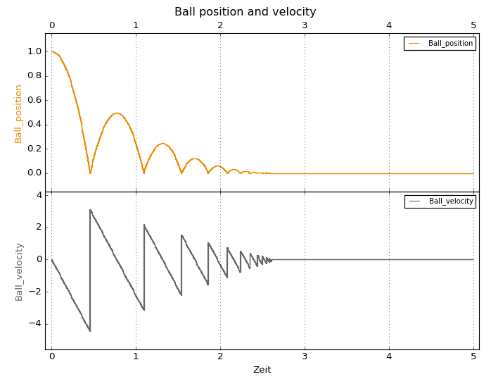
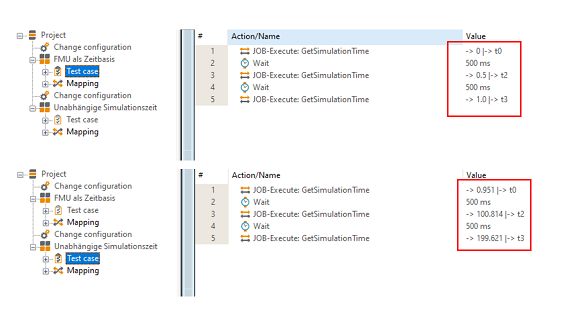

    

This demo shows the tool connection of ECU-TEST to FMI.

## Preconditions

A current version of ECU-TEST is required. Some features are partially implemented with the latest FeatureSet and therefore do not run with the current official release. For details see [Changelog](CHANGELOG.md) or see Commit-History.
For some releases, tags compatible with official releases are created.

## Setup

Download the repo or clone it somewhere. Open ECU-TEST and select the folder "ECU-TEST" as workspace. 
Done.

## Content
[Changelog](CHANGELOG.md)

The repo contains only the ECU-TEST workspace with all necessary configurations, several test cases to demonstrate the different settings and two FMUs.
The FMUs are the BouncingBall, an ACC controller and PythonFMU-based models that have to be compiled in advance. The ACC controller was developed as a Simulink model and converted to an FMU.
The BouncingBall FMU is available in the [FMI-Cross-Ckeck-Repository](https://github.com/modelica/fmi-cross-check).

The test cases are sorted into folders according to the corresponding FMU. The execution is best done with the help of the projects in the "Projects" folder, since the correct configurations for the test cases are always associated here.

### ACC

The tests in the ACC folder are primarily intended to show a functional model that has a practical relevance to an automotive use case. 
It is best to execute the project "*ACC_ComponentTests*" in the "Projects" folder. 

Nothing FMU-specific is shown in the tests. However, at this point you can, for example, go into the model access and show the available test variables.

Depending on who you show the demo to, you can explain the technical background of the signals and parameters here: 

The representation of the signals and parameters depends exclusively on the "modelDescription.xml", which is part of an FMU. Since an FMU is a zip container, this file type can be opened, for example, via the 'Windows context menu > 7-zip > open'. In addition to the xml interface description, the executable binaries and optionally the sources as well as a documentation are located in the fmu container.
In the model description there is the entry "ModelVariables" further down. Depending on what is entered here under "causality" or "variability", the entry is displayed in ECU-TEST. These two entries are related to each other, changing one will lead to an error in most cases.

As an example: *causality="parameter" variability="tunable "* is displayed as parameter, *causality="output" variability="continuous "* as signal. In the back, a *description* can be inserted. This is displayed in ECU-TEST in brackets after the signal name. But currently only for signals and not for parameters.

Description of the test contents:

- ACC_activate

   Here everything is parameterized in the preconditions so that the ACC controller is in a valid state and should be able to be activated. In the test case, ACC is switched on and a trace analysis is used to check whether the ACC status changes to "Active" (or 1).
   

- ACC_activate_with_brake

   Similar to the "ACC_activate" test case, a valid state is parameterized in the preconditions. In the test case ACC is then activated and it is checked whether the status changes to active. Afterwards it is deactivated again and checked that the status changes to "Inactive". Then the brake is applied and an attempt is made to activate ACC. Activating ACC while the brake is applied is not allowed, so it is checked that the status remains "Inactive". 

- ACC_approach

   In this test case, the ACC controller is switched on in the preconditions, but with a too great distance to the vehicle in front, so that the status remains "Inactive". In the test case, the distance to the vehicle in front is reduced continuousely and the trace analysis checks that the ACC controller will switch to "Active" status during further approach. 

### BouncingBall
The BouncingBall simulates a ball that is dropped from a certain height. In the trace analysis, the position h and the velocity v are shown by default.

To visualize this, you can run the project "*BouncingBall_ParameterSets*" in the "Projects" folder. Here, the BouncingBall experiment is parameterized with different gravitational accelerations and simulated in each case.

In the Traceanalysis a simple model based on the apparent linear decay of the maximum velocity, therefore a quadratic decay of the maximum height, is checked against the outcome of the simulation. 
This is done using the TraceStepTemplate CheckSignalInEnvelope.

The folder "*Auto_Manual_Simulation*" contains test cases for automatic or manual simulation execution. Either you set the setting in the TBC manually during the demo (open TBC, select 'Modelica Association: FMI' and check/uncheck 'Automatically Start/Stop Simulation') and execute the package or you use the projects "Auto" or "Manual" which select a corresponding TBC automatically. 

The project "*TimeBase_Comparison*" shows the difference when the model is used as a time base or not. The test case consists of wait steps and the GetSimulationTime job. The Wait steps correspond either to the model time or the system time. If the model time is used, the Wait times correspond to the returned values of the model. If the model is not used as a time base, the model time deviates considerably. In our example, about 100s elapse in the model in 500 ms !

In the report you can easily see the difference: 

   

### MultipleModelsParallel

In this use case, the simultaneous simulation of two different FMUs is demonstrated. For this purpose the project 
"MultipleModelsParallel.prj" is available. 
In the testbench configuration, two model ports are configured accordingly for the simultaneous execution of two FMU test objects. 

**Note:** The simulation of the FMUs is started simultaneously, but their time synchronization is not guaranteed by ECU-TEST. In general, therefore, the simulation times of the two FMUs will diverge.

Both FMUs are used in the test case. Since the BouncingBall cannot really be stimulated, we use the output variable v (speed) as input variable for our ACC controller. 

The ACC controller is parameterized in a way that it can change to the status "active". In the test case a loop is run through which switches the ACC controller on whenever the speed of the ball is less than 0.1 m/s and switches it off otherwise.
In the trace analysis you can see in the plot how the status of the ACC controller changes between 0 and 1 (Inactive / Active) depending on the speed of the ball. 

### PythonFMU
This workflow lightweight framework that enables the packaging of Python 3 code or CSV files as co-simulation FMUs (following FMI version 2.0).
Refer to [PythonFMU Doc](ECU-TEST/FMUs/readme.md)

### TimeBase Comparison

This allows to show the different simulation modes.

The basis is the BouncingBall example with adapted configurations in each case. In the real-time case, the simulation speed is set to 1 in the TBC, and to 4 in the simulation case.
The used Package then queries the simulation time and different signals from the tool and executes different waiting times.
The report can then nicely show the documented simulation mode as well as the different times in the test case. To do this, display the various time columns in the report viewer.

The slides  [ECU-TEST Virtual Testing](https://intranet.tracetronic.de/Marketing/Prsentationen/Masterfoliens%C3%A4tze/Produkte/ECU-TEST%20Virtual%20Testing.pptx?Web=1) can be used as an introduction.
